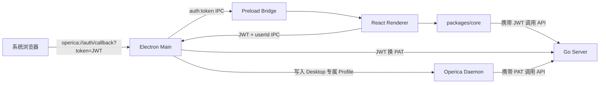
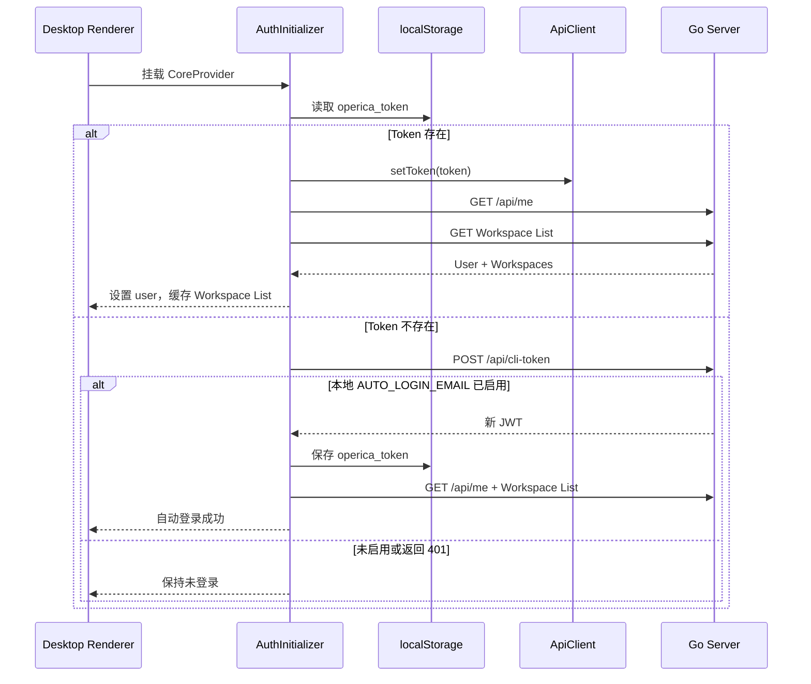
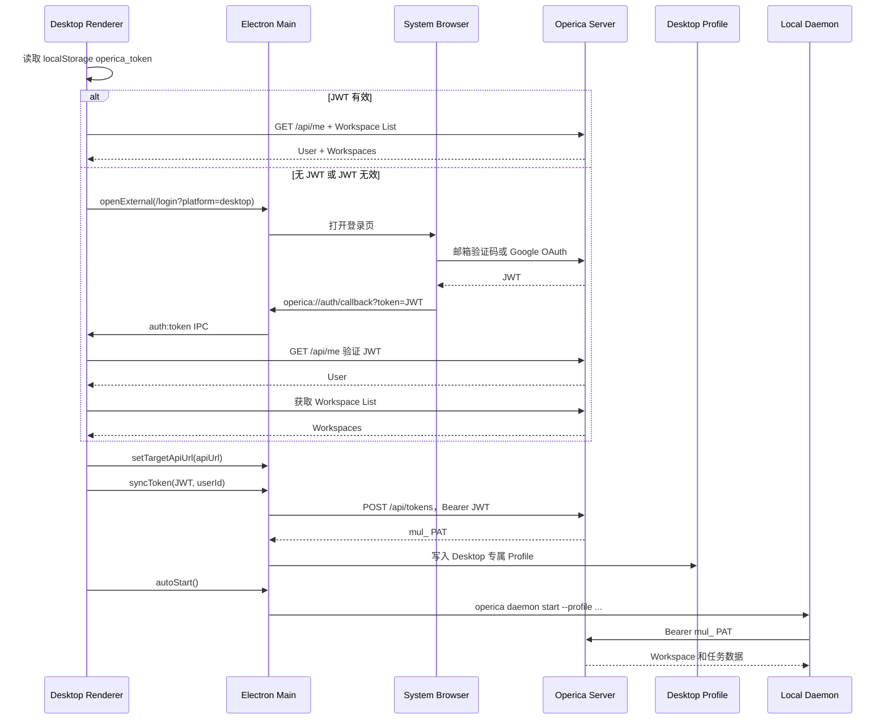

# Operica 桌面端自动登录与 JWT 认证架构

本文基于当前代码实现，说明 Operica Desktop 从启动、恢复登录、浏览器登录回传，到 JWT 校验、Workspace 初始化和本地 Daemon 认证的完整流程。

## 1. 架构概览

桌面端由五层组成：

1. Electron 主进程：窗口、协议链接、IPC、本地 CLI 和 Daemon 生命周期。
2. Preload：通过 `contextBridge` 暴露受控的 Desktop API 和 Daemon API。
3. React Renderer：登录状态、页面渲染、Workspace 和 Tab 管理。
4. `packages/core`：共享 API Client、Auth Store、React Query、WebSocket。
5. Go Server：登录、JWT 签发、认证中间件、PAT 签发和业务 API。

## 2. 桌面端启动流程

入口是 `apps/desktop/src/main/index.ts`。

### 2.1 主进程初始化

启动时依次完成：

1. 修复 macOS/Linux GUI 进程的 `PATH`，保证能够找到 `operica`、Claude、Codex、OpenCode 等 CLI。
2. 注册 `operica://` 自定义协议。
3. 获取单实例锁，避免多个桌面实例争抢协议链接和本地状态。
4. 加载运行时配置。
5. 注册 IPC Handler。
6. 创建主窗口。
7. 初始化自动更新、Daemon Manager 和本地目录能力。

### 2.2 运行时服务地址

运行时配置由 `apps/desktop/src/main/runtime-config-loader.ts` 加载。

开发模式默认使用：

- API：`http://localhost:8080`
- WebSocket：`ws://localhost:8080/ws`
- Web：`http://localhost:3000`

生产模式优先读取：

`~/.operica/desktop.json`

文件不存在时使用 Operica Cloud 默认地址。文件存在但格式错误时，桌面端阻止继续启动，不会静默回退到云端，避免把凭证发送到错误的后端。

### 2.3 Preload 边界

`apps/desktop/src/preload/index.ts` 不直接把 Electron API 暴露给 Renderer，而是提供受控接口：

- `desktopAPI.onAuthToken()`：接收登录 JWT。
- `desktopAPI.openExternal()`：打开系统浏览器。
- `desktopAPI.reportAuthSession()`：只上报用户 ID，不跨窗口传输 Token。
- `daemonAPI.syncToken()`：把登录凭证同步给主进程。
- `daemonAPI.reauthenticate()`：修复 Daemon 凭证失效。
- `daemonAPI.start/stop/restart()`：管理 Daemon。

## 3. JWT 的签发和校验

### 3.1 JWT 签发

服务端在 `server/internal/handler/auth.go` 的 `issueJWT()` 中签发 JWT。

JWT 使用 HS256，包含：

- `sub`：用户 UUID。
- `email`：用户邮箱。
- `name`：用户名称。
- `iat`：签发时间。
- `exp`：过期时间。

默认有效期为 30 天，可通过 `AUTH_TOKEN_TTL` 配置。

签名密钥由 `server/internal/auth/jwt.go` 的 `JWTSecret()` 提供：

1. 优先读取 `JWT_SECRET`。
2. 未配置时使用开发默认值。
3. 使用 `sync.Once` 在进程内只初始化一次。

生产环境必须设置独立且足够随机的 `JWT_SECRET`。修改密钥会让此前签发的全部 JWT 立即失效。

### 3.2 服务端认证中间件

`server/internal/middleware/auth.go` 按以下顺序提取认证信息：

1. `Authorization: Bearer <token>`。
2. `operica_auth` HttpOnly Cookie。

Token 类型按前缀或格式区分：

| 类型 | 前缀/形式 | 用途 |
| --- | --- | --- |
| Agent Task Token | `mat_` | Agent 单任务授权 |
| Cloud Node PAT | `mcn_` | Cloud Node 机器凭证 |
| Personal Access Token | `mul_` | CLI、Daemon 长期凭证 |
| JWT | 标准 JWT | 用户会话与桌面端登录 |

JWT 校验通过后，中间件把 `sub` 写入请求头 `X-User-ID`，后续 Handler 从该请求上下文识别当前用户。

Cookie 模式下，修改数据的请求还必须通过 CSRF 校验。桌面端当前使用 Bearer Token 模式，不依赖浏览器 Cookie。

## 4. 桌面端自动恢复登录

核心逻辑位于：

- `packages/core/platform/core-provider.tsx`
- `packages/core/platform/auth-initializer.tsx`
- `packages/core/auth/store.ts`
- `apps/desktop/src/renderer/src/App.tsx`

### 4.1 Core 初始化

`CoreProvider` 在第一次渲染时创建：

- `ApiClient`
- Auth Zustand Store
- Chat Zustand Store
- React Query Provider
- WebSocket Provider

桌面端没有传入 `cookieAuth=true`，因此使用 Token 模式。

### 4.2 从 localStorage 恢复 JWT

JWT 保存位置为 Renderer 的 localStorage：

`operica_token`

启动时流程如下：

普通恢复登录的判断依据不是“localStorage 有 Token 就算成功”，而是必须通过：

- `GET /api/me`
- Workspace List 请求

两者成功后才设置当前用户并进入桌面 Shell。

### 4.3 本地开发自动登录

本地开发可在 Server 配置：

`AUTO_LOGIN_EMAIL=<用户邮箱>`

当请求没有 Token 时，认证中间件会查找该邮箱对应的用户，并把请求视为该用户发起。

但 Daemon 不能只依赖这个无 Token 绕过，它需要真实凭证。因此 Desktop 在没有本地 Token 时调用：

`POST /api/cli-token`

此请求先通过 `AUTO_LOGIN_EMAIL` 获得用户身份，再由服务端签发真实 JWT。Desktop 将 JWT 保存到 `operica_token`，后续流程与正常登录一致。

如果保存的是本地后端重置前签发的旧 JWT：

1. `/api/me` 返回 401。
2. Desktop 清除旧 Token。
3. 再尝试一次 `POST /api/cli-token`。
4. `AUTO_LOGIN_EMAIL` 有效时重新签发 JWT 并恢复登录。
5. 否则进入正常登录页。

`AUTO_LOGIN_EMAIL` 是开发便利能力，不应在生产环境启用。

## 5. 浏览器登录回传桌面端

桌面端登录页位于 `apps/desktop/src/renderer/src/pages/login.tsx`。

点击 Google 登录时，Desktop 使用系统浏览器打开：

`<appUrl>/login?platform=desktop`

### 5.1 浏览器已有登录会话

Web 登录页检测到：

- `platform=desktop`
- 当前浏览器已有 Cookie 会话

随后调用：

`POST /api/cli-token`

服务端签发新的 JWT，Web 页面跳转到：

`operica://auth/callback?token=<JWT>`

### 5.2 浏览器重新登录

用户完成邮箱验证码或 Google OAuth 后，Web 获得 JWT，再跳转到相同的 `operica://auth/callback` 地址。

### 5.3 Electron 接收 Deep Link

`apps/desktop/src/main/index.ts` 处理三种场景：

- macOS `open-url`。
- Windows/Linux 第二实例参数。
- Windows/Linux冷启动参数。

主进程解析 URL，仅接受：

- 协议：`operica:`
- Host：`auth`
- Path：`/callback`

然后通过 `auth:token` IPC 把 JWT 发给主窗口。消息在 Renderer Listener 尚未就绪时会进入队列，避免冷启动时丢失登录回调。

### 5.4 Renderer 完成登录

`apps/desktop/src/renderer/src/App.tsx` 订阅 `onAuthToken()`：

1. `loginWithToken(token)` 把 JWT 写入 `operica_token`。
2. `ApiClient.setToken(token)`。
3. 请求 `/api/me` 验证 Token 并获取用户。
4. 请求 Workspace List。
5. 把 Workspace List 写入 React Query Cache。
6. 结束启动状态并进入 `DesktopShell`。

在 `/api/me` 校验成功之前，Deep Link 中的 Token 不会被视为有效登录。

## 6. API 请求与 WebSocket 认证

### 6.1 HTTP API

`packages/core/api/client.ts` 在 Token 模式下为请求添加：

`Authorization: Bearer <JWT>`

当服务端返回 401 时：

1. ApiClient 清除内存 Token。
2. 删除 `operica_token`。
3. Auth 初始化或页面状态回到未登录状态。

网络错误和 5xx 不应被当作登录失效，避免临时故障导致用户被强制登出。

### 6.2 WebSocket

`packages/core/realtime/provider.tsx` 从 Storage 读取 `operica_token`，交给 `WSClient`。

连接建立后，Token 模式通过 WebSocket 消息发送认证信息，服务端返回 `auth_ack` 后才进入正常实时同步。

Workspace 实时连接同时绑定当前 Workspace Slug。

## 7. Workspace、路由和桌面 Shell

认证成功后，`AppContent` 获取并缓存 Workspace List，然后渲染 `DesktopShell`。

桌面路由使用 `createMemoryRouter`，定义在 `apps/desktop/src/renderer/src/routes.tsx`。业务路由全部带 Workspace Slug：

`/{workspaceSlug}/issues`

`/{workspaceSlug}/projects`

`/{workspaceSlug}/agents`

`/{workspaceSlug}/runtimes`

`WorkspaceRouteLayout` 负责：

1. 根据 URL Slug 从 Workspace List 解析 Workspace UUID。
2. 调用 `setCurrentWorkspace(slug, id)`。
3. 让 ApiClient 自动添加 `X-Workspace-Slug`。
4. 为 Query Key、持久化命名空间和实时连接提供 Workspace 身份。
5. 清理已经无权访问的持久化 Tab。

登录、Onboarding、新建 Workspace、接受邀请等前置流程不使用桌面路由，而使用 Window Overlay。

## 8. JWT 与 Daemon PAT 的关系

Desktop UI 和本地 Daemon 使用不同层级的凭证：

- Desktop Renderer：用户 JWT。
- Local Daemon：长期 PAT，前缀为 `mul_`。
- Agent 子进程：任务级 Token，前缀为 `mat_`。

JWT 不直接作为 Daemon 的长期凭证。登录成功后，`App.tsx` 调用：

`syncDaemonOnLogin(apiUrl, jwt, userId)`

严格顺序为：

1. `setTargetApiUrl(apiUrl)`。
2. `syncToken(jwt, userId)`。
3. `autoStart()`。

这个顺序用于确保凭证写入 Desktop 专属 Profile，而不是误写用户默认的 `~/.operica` CLI Profile。

### 8.1 JWT 换 PAT

Electron 主进程的 `daemon-manager.ts` 使用 JWT 调用：

`POST /api/tokens`

请求名称为 `Operica Desktop`。服务端：

1. 通过 JWT 中间件确认用户身份。
2. 生成 `mul_` PAT。
3. 数据库只保存 SHA-256 Hash 和 Token 前缀。
4. 原始 PAT 只在创建响应中返回一次。

Desktop 将 PAT 写入目标 API 对应的独立 Profile 配置，Daemon 启动时读取该 PAT。

### 8.2 PAT 复用和账号切换

每个 Desktop Profile 还保存绑定的用户 ID：

- 同一用户且已有 `mul_` PAT：复用现有 PAT。
- 首次运行：签发新 PAT。
- 用户发生切换：签发新 PAT，覆盖旧配置并重启 Daemon。
- 登出：删除 Profile Token 和用户 ID Sidecar，然后停止 Daemon。

这样可以防止用户 B 登录后继续使用用户 A 的 Daemon 凭证。

### 8.3 Daemon 凭证失效恢复

Daemon 启动后若长期无法进入 Running 状态，主进程会使用 Profile 中的 Token 请求 `/api/me`：

- 401：状态标记为 `auth_expired`。
- 2xx：Token 有效，问题不属于认证失效。
- 网络错误或 5xx：视为临时故障，不强制退出用户。

用户触发重新认证时：

1. 清除缓存 PAT。
2. 使用当前 Desktop JWT 创建新 PAT。
3. 写回 Profile。
4. 重启 Daemon。

只有 JWT 自身被服务端以 401 拒绝时，Desktop 才执行完整登出。网络错误、5xx、配置写入失败或重启失败只提示重试。

## 9. 登出和多窗口隔离

### 9.1 主窗口登出

`handleDaemonLogout()` 执行：

1. 向主进程报告用户 ID 为 `null`。
2. 重置桌面 Tab Store。
3. 关闭 Window Overlay。
4. 清理 Onboarding 临时状态。
5. 清除 Daemon Profile Token。
6. 停止 Daemon。

Auth Store 同时：

- 删除 `operica_token`。
- 清除 ApiClient Token。
- 清除当前 Workspace。
- 清除 Analytics Identity。

### 9.2 独立 Issue 窗口

主窗口和独立 Issue 窗口不会互相传输 JWT。

每个 Renderer 只向 Main 上报解析后的用户 ID。`AuthSessionCoordinator` 比较用户 ID：

- 主窗口登出：关闭全部 Issue 窗口。
- 主窗口切换账号：关闭旧账号的 Issue 窗口。
- Issue 窗口账号与主窗口不一致：关闭该 Issue 窗口。

该设计降低了 Token 在多个 Renderer 之间复制和泄露的风险。

## 10. 关键安全边界

### 已有保护

1. Deep Link Token 收到后仍需 `/api/me` 二次校验。
2. 主窗口和 Issue 窗口只同步用户 ID，不同步 Token。
3. PAT 在数据库中只保存 Hash。
4. 账号切换时轮换 Daemon PAT。
5. 401 与临时网络错误分开处理，避免错误登出。
6. Runtime Config 错误时阻止启动，避免连接错误后端。
7. Web 的 CLI Callback 和 `next` 参数经过 URL 校验。
8. 服务端拒绝非 HMAC JWT 签名算法。
9. Cookie 登录的写操作受 CSRF 保护。

### 当前需要关注的风险

1. Desktop JWT 保存在 Renderer localStorage，不是操作系统钥匙串。Renderer 一旦发生 XSS 或加载不可信内容，Token 可能被读取。
2. `BrowserWindow` 当前设置了 `sandbox: false` 和 `webSecurity: false`，安全边界比 Electron 推荐默认值更宽。
3. JWT 使用共享 HS256 密钥，任何掌握 `JWT_SECRET` 的服务都可以签发任意用户 JWT。
4. 开发默认 JWT Secret 不可用于生产环境。
5. Deep Link 把 JWT 放在 URL Query 中。虽然生命周期短且最终会验证，但 URL 可能进入操作系统或浏览器历史、诊断日志。
6. Desktop 为 Daemon 创建的 PAT 当前请求未指定过期时间，因此服务端创建为不过期 Token；安全性依赖登出清理、用户主动撤销和本地 Profile 文件保护。
7. `AUTO_LOGIN_EMAIL` 会让无凭证请求自动获得指定用户身份，只能用于受控本地开发环境。

## 11. 完整时序

## 12. 关键代码索引

| 职责 | 文件 |
| --- | --- |
| Electron 启动、窗口、协议链接、IPC | `apps/desktop/src/main/index.ts` |
| Preload API Bridge | `apps/desktop/src/preload/index.ts` |
| Desktop Renderer 总入口 | `apps/desktop/src/renderer/src/App.tsx` |
| Desktop 登录页 | `apps/desktop/src/renderer/src/pages/login.tsx` |
| Auth 初始化 | `packages/core/platform/auth-initializer.tsx` |
| Core 单例和 ApiClient 初始化 | `packages/core/platform/core-provider.tsx` |
| Auth Zustand Store | `packages/core/auth/store.ts` |
| API Bearer Token | `packages/core/api/client.ts` |
| WebSocket Token 认证 | `packages/core/api/ws-client.ts` |
| Web Desktop 登录中转 | `apps/web/app/(auth)/login/page.tsx` |
| Google OAuth Desktop 回调 | `apps/web/app/auth/callback/page.tsx` |
| JWT 密钥和 Token 工具 | `server/internal/auth/jwt.go` |
| JWT 签发和登录 Handler | `server/internal/handler/auth.go` |
| JWT/PAT 认证中间件 | `server/internal/middleware/auth.go` |
| Cookie 和 JWT TTL | `server/internal/auth/cookie.go` |
| PAT 创建与续期 | `server/internal/handler/personal_access_token.go` |
| Daemon Token 同步和生命周期 | `apps/desktop/src/main/daemon-manager.ts` |
| 登录后 Daemon 启动顺序 | `apps/desktop/src/renderer/src/platform/daemon-login-sync.ts` |
| Daemon 重新认证 | `apps/desktop/src/renderer/src/platform/daemon-reauth.ts` |
| Desktop 路由 | `apps/desktop/src/renderer/src/routes.tsx` |
| Workspace 路由解析 | `apps/desktop/src/renderer/src/components/workspace-route-layout.tsx` |
